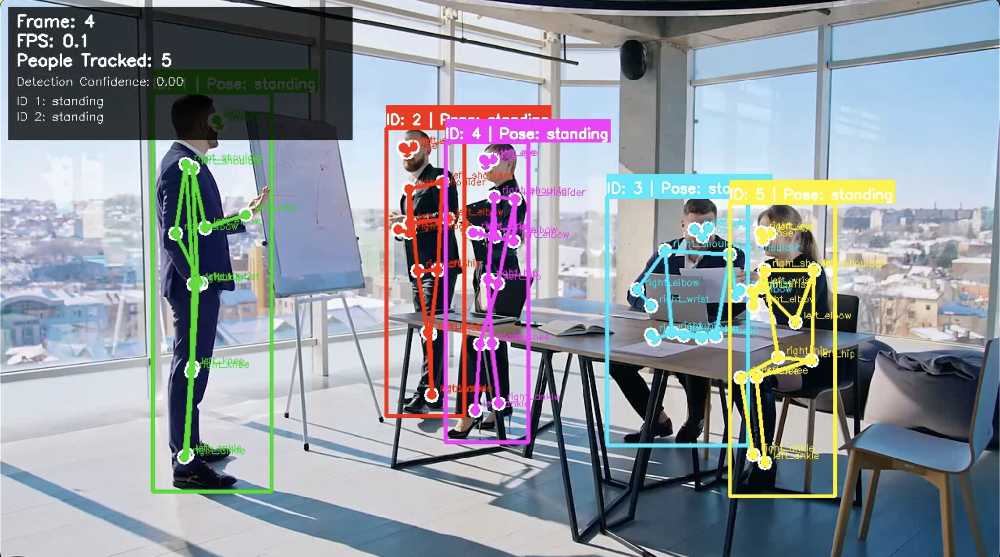

# Vision LLM Video QA

A comprehensive video analysis system that combines computer vision, object tracking, pose estimation, and large language models to answer natural language questions about video content.



## 🚀 Features

- **Object Detection & Tracking**: YOLOv8 + DeepSORT for robust object tracking
- **Pose Estimation**: Human pose keypoint detection and interpretation
- **Color Analysis**: Dominant color extraction for objects
- **Scene Analysis**: Brightness and lighting detection
- **Knowledge Graph Construction**: Structured representation of video content
- **LLM Integration**: Ollama-based question answering
- **Visualization**: Multi-phase video analysis showcase

## 📁 Project Structure

```
vision_llm_video_qa/
├── analyze_video.py          # Main analysis pipeline
├── create_viz.py            # Visualization generation
├── visualize_tracking.py    # Basic people tracking visualization
├── advanced_tracking.py     # Advanced tracking with better models
├── demo_visualization.py    # Interactive demo script
├── example.py               # Usage examples
├── data/                    # Sample data and results
│   └── videoplayback.mp4    # Sample video
├── llm/                     # Language model integration
│   ├── __init__.py
│   └── ollama_analyzer.py   # Ollama LLM analyzer
├── models/                  # Pre-trained models
│   └── detector/
│       ├── yolov8l.pt       # YOLOv8 Large detection model
│       ├── yolov8l-pose.pt  # YOLOv8 Large pose model
│       └── yolo11n-pose.pt  # YOLO nano pose model (backup)
├── vision/                  # Computer vision modules
│   ├── __init__.py
│   ├── detector_tracker.py  # Combined detection & tracking
│   ├── pose_estimator.py    # Pose estimation
│   ├── pose_logic.py        # Pose interpretation
│   ├── tracker.py           # DeepSORT tracker
│   └── yolo_detector.py     # YOLO detector
├── video_kg/                # Knowledge graph construction
│   ├── __init__.py
│   ├── builder.py           # KG builder
│   └── schemas.py           # Data schemas
└── vox_samples/             # Sample videos (large files)
```

## 🛠️ Installation

### Prerequisites

- Python 3.8+
- OpenCV
- PyTorch
- Ollama (for LLM functionality)

### Setup

1. **Clone the repository**
   ```bash
   git clone <repository-url>
   cd vision_llm_video_qa
   ```

2. **Install Python dependencies**
   ```bash
   pip install -r requirements.txt
   ```

3. **Install and setup Ollama**
   ```bash
   # Install Ollama (macOS)
   curl -fsSL https://ollama.ai/install.sh | sh
   
   # Pull the required model
   ollama pull gemma:2b
   ```

4. **Download YOLO models** (if not already present)
   ```bash
   # The system will automatically download yolov8n.pt on first run
   # For pose estimation, ensure yolo11n-pose.pt is in models/detector/
   ```

## 🎯 Usage

### Basic Video Analysis

```python
from analyze_video import analyze_video

# Analyze a video with a question
result = analyze_video(
    video_path="path/to/your/video.mp4",
    question="How many people are in the video?",
    max_seconds=10
)
print(result)
```

### People Tracking Visualization

#### Basic Tracking
```python
from visualize_tracking import PeopleTrackingVisualizer

# Initialize visualizer
visualizer = PeopleTrackingVisualizer(device="cpu")

# Process video with tracking and pose estimation
visualizer.process_video(
    video_path="path/to/your/video.mp4",
    output_path="output_tracking.mp4",
    max_frames=300
)

# Or use webcam for real-time tracking
visualizer.process_webcam()
```

#### Advanced Tracking (Better Models)
```python
from advanced_tracking import AdvancedPeopleTracker

# Initialize with better models (YOLOv8 Large)
tracker = AdvancedPeopleTracker(device="mps")  # Use MPS for Apple Silicon

# Process video with enhanced tracking
tracker.process_video(
    video_path="path/to/your/video.mp4",
    output_path="advanced_output.mp4",
    max_frames=300,
    show_labels=True  # Show keypoint labels
)
```

### Quick Demo

```bash
# Run interactive demo
python demo_visualization.py

# Basic tracking
python visualize_tracking.py --video input.mp4 --output output.mp4
python visualize_tracking.py --webcam

# Advanced tracking with better models
python advanced_tracking.py --video input.mp4 --output output.mp4
python advanced_tracking.py --webcam --no-labels  # Cleaner view
```

### Generate Visualization Videos

```python
from create_viz import generate_showcase_videos

# Generate analysis visualization videos
generate_showcase_videos()
```

### Direct Module Usage

```python
from vision.yolo_detector import YOLODetector
from vision.tracker import DeepSortTracker
from video_kg.builder import build_knowledge_graph
from llm.ollama_analyzer import OllamaAnalyzer

# Initialize components
detector = YOLODetector(model_path="yolov8n.pt", device="cpu")
tracker = DeepSortTracker()
analyzer = OllamaAnalyzer(model="gemma:2b")

# Build knowledge graph
kg = build_knowledge_graph(video_path, detector, tracker, max_seconds=10)

# Analyze with LLM
response = analyzer.analyze(kg, "Describe what you see in the video")
```

## 🔧 Configuration

### Model Paths
- **YOLO Detection**: `yolov8n.pt` (auto-downloaded) or `models/detector/yolov8l.pt` (better)
- **Pose Estimation**: `models/detector/yolo11n-pose.pt` (basic) or `models/detector/yolov8l-pose.pt` (better)
- **LLM Model**: `gemma:2b` (via Ollama)

### Analysis Parameters
- `max_seconds`: Maximum video duration to analyze
- `device`: CPU/GPU/MPS for model inference (use "mps" for Apple Silicon)
- `confidence_threshold`: Detection confidence (default: 0.5)

## 📊 Analysis Pipeline

The system follows a 3-phase analysis pipeline:

### Phase 1: Detection & Tracking
- YOLO object detection
- DeepSORT object tracking
- Entity ID assignment

### Phase 2: Attribute Analysis
- Pose estimation for humans
- Dominant color extraction
- Scene brightness analysis
- Spatial relationship mapping

### Phase 3: Knowledge Synthesis
- Knowledge graph construction
- LLM-based question answering
- Natural language response generation

## 🎨 Visualization

The system generates three types of visualization videos:

1. **Detection & Tracking**: Shows bounding boxes and track IDs
2. **Attribute Analysis**: Displays pose keypoints and color information
3. **Synthesis & Q&A**: Presents the final analysis results

## 🤖 LLM Integration

The system uses Ollama with the Gemma 2B model for natural language understanding and question answering. The LLM receives structured knowledge graph data and generates human-readable responses.

### Supported Question Types
- Object counting and identification
- Spatial relationship queries
- Pose and action analysis
- Color and attribute questions
- Temporal analysis
- Complex multi-part questions

## 📝 Example Questions

```
- "How many people are visible in the video?"
- "What is the dominant color of the person on the left?"
- "Describe the pose of the person in the center"
- "Who is sitting and who is standing?"
- "What is the spatial relationship between the two people?"
- "Is the scene well-lit or dark?"
```

## 🚨 Troubleshooting

### Common Issues

1. **Ollama not running**
   ```bash
   # Start Ollama service
   ollama serve
   ```

2. **Model download issues**
   ```bash
   # Manually download YOLO models
   wget https://github.com/ultralytics/assets/releases/download/v0.0.0/yolov8n.pt
   ```

3. **CUDA/GPU issues**
   ```python
   # Force CPU usage
   detector = YOLODetector(device="cpu")
   ```

### Performance Tips

- Use GPU for faster inference (if available)
- Reduce `max_seconds` for quicker analysis
- Lower resolution videos for faster processing
- Use smaller YOLO models for speed vs. accuracy trade-off

## 🤝 Contributing

1. Fork the repository
2. Create a feature branch
3. Make your changes
4. Add tests if applicable
5. Submit a pull request

## 📄 License

This project is licensed under the MIT License - see the LICENSE file for details.

## 🙏 Acknowledgments

- [Ultralytics YOLOv8](https://github.com/ultralytics/ultralytics)
- [DeepSORT](https://github.com/mikel-brostrom/yolov8_tracking)
- [Ollama](https://ollama.ai/)
- [OpenCV](https://opencv.org/)

## 📞 Support

For questions and support, please open an issue on GitHub or contact the maintainers.
